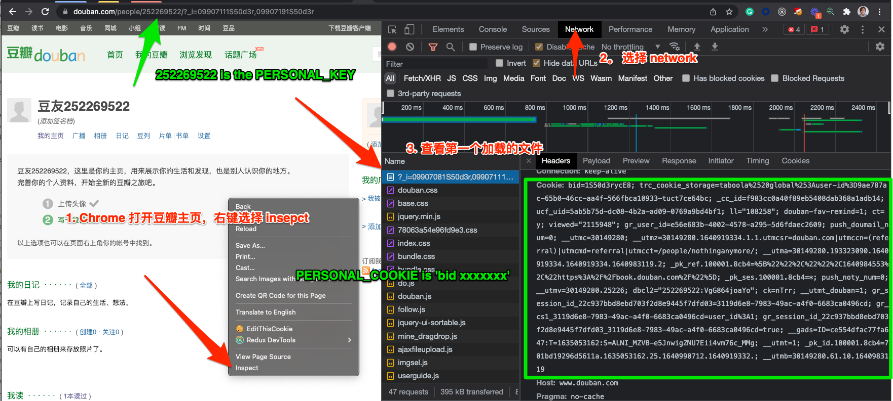

# 写在前面
> 作为豆瓣的一个深度用户，这里凝结着这些年来看过的书，做过的思考，每每闲来无事，会希望能反复翻阅曾经的只言片语。近来由于担心自己的数据突然消失，故认为还是有一份本地保存的好，如果你也有类似的想法，那么这个小工具大概适合你。

**这份工具基于Mac环境开发，但我觉得其他操作系统应该也是支持的。** :smirk:

# Support List
## 书
- 想读
- 在读
- 读过
- 笔记
***

## 影视
- 想看
- 在看
- 看过
***

## 音乐
- 想听
- 在听
- 听过
***

## 评论
- 影评
- 书评
***

## 日记
- 所有对当前用户可见的日记
***

## 个人动态、相册 （暂不支持）
***

# 安装方式
## 预安装基本开发环境
- 打开电脑运行终端 (command + space serach: terminal)
- Install **[Git](https://git-scm.com/download/mac)**
- Install the lastest **[Nodejs](https://nodejs.org/en/)**
- Install **[npm](https://docs.npmjs.com/downloading-and-installing-node-js-and-npm)**

```bash
brew install git

#(或者直接根据上面的网址下载 nodejs)
brew install node

npm install -g npm
```

## 如何获取环境变量，后面会用到

## eg.


## 进入正式开发环境
```bash
# 下载
git clone https://github.com/VeraWei/douban-data-storage.git

# 安装依赖
npm install

# 在终端中设置个人环境变量, key 没有单引号，cookie有。
export PERSONAL_KEY=[your-douban-id]
export PERSONAL_COOKIE='your-cookie'


# 获取所有html页面数据
npm run load

# 如果你想要获得完整的JSON 数据可以继续执行
npm run parser

# 执行完所有人物后，可以在你本地的 personal 文件夹下看到所有的数据内容，应该是一些html和几份json文件
# html 只做了简单的处理，可直接打开。
## output directory
/personal
  /book
    /annotation
    /collect
    /do
    /wish
  /music
    /collect
    /do
    /wish
  /movie
    /collect
    /do
    /wish
  /reviews
    /list
    /detail
  /notes
    /list
    /detail
  /json
    annotation.json
    book.json
    movie.json
    music.json
    reviews.json
    notes.json
```

# Next
## 我用我自己的这些数据来做了什么，仅供你参考。[TODO]
- 重新布局渲染页面
- 发布到 **[个人主页](https://verawei.github.io/mymind)**
- 也许可以设置github actions 去自动执行更新数据任务